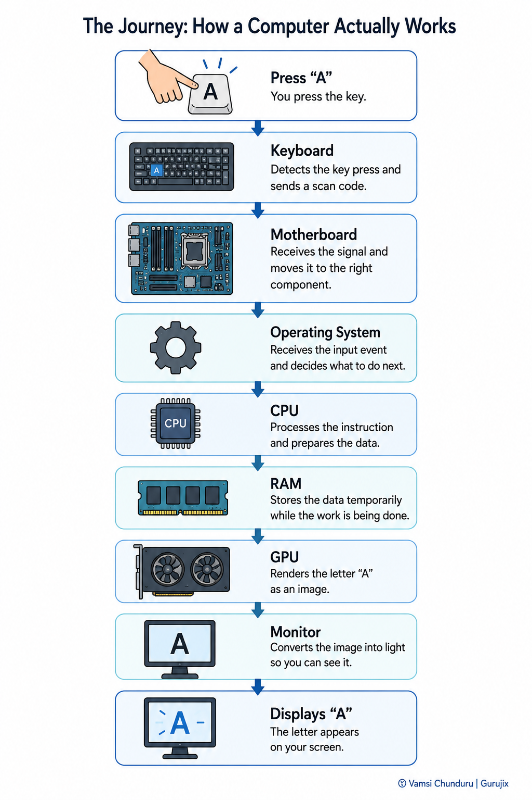
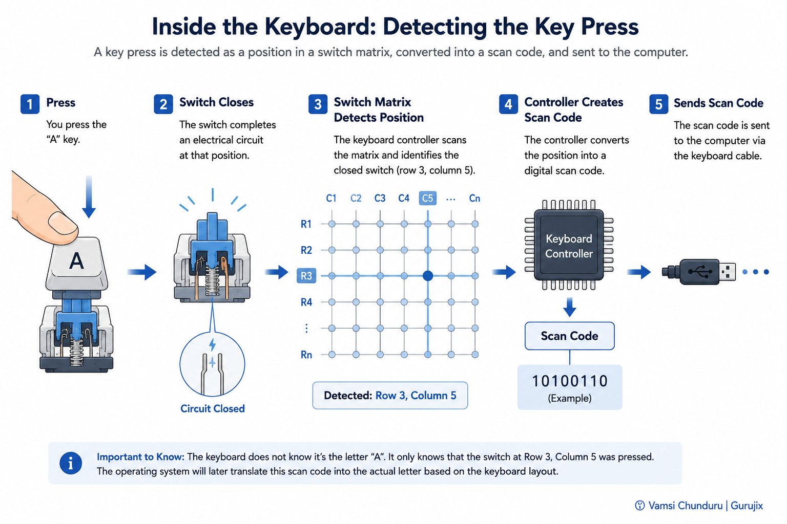
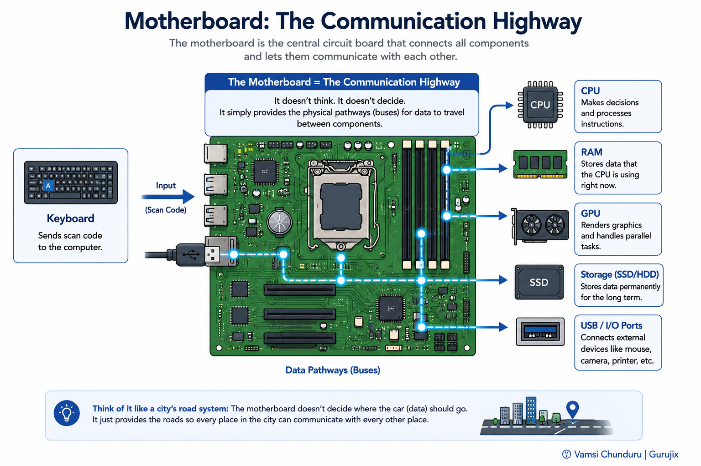
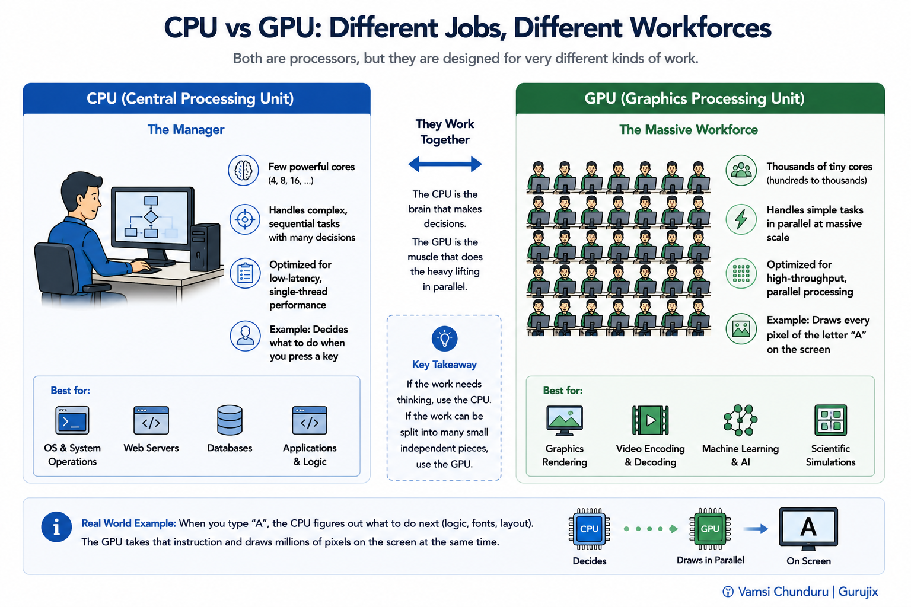
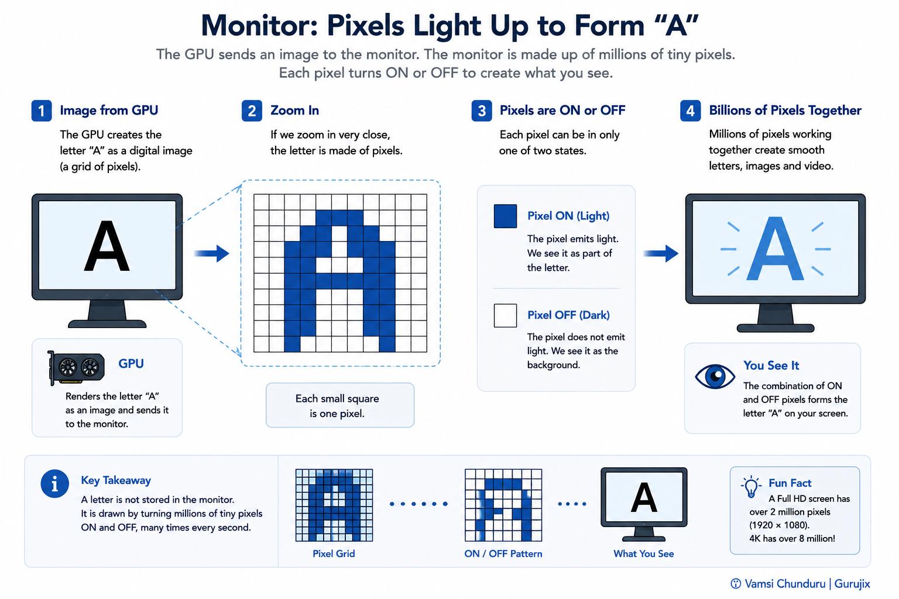

# 🖥️ How a Computer Actually Works

> Understanding how hardware works together to run every application you use.

> Part of the [Software Engineering Handbook](../../../README.md) → [Computer Science Fundamentals](../../README.md) → [Computer Systems](../README.md)

---

## 📌 Chapter Info

| | |
|---|---|
| **Prerequisites** | None — this is a starting point |
| **⏱ Estimated Reading Time** | 15–20 minutes |
| **Difficulty** | 🟢 Beginner |

---

## 📖 Overview

You press the letter **A**. A fraction of a second later, it appears on your screen. It feels almost magical — but nothing about it is magic.

This chapter follows one key press on its entire journey through your computer's hardware. By the end, you'll know exactly which component does what, in what order, and why — not by memorizing a list of parts, but by watching them work together to solve one small mystery.

---

## 🎯 Learning Objectives

By the end of this chapter, you should be able to:

- Name every major hardware component a computer uses to turn an input into an output.
- Explain, step by step, what happens between a key press and a character appearing on screen.
- Explain the specific job of the CPU, RAM, GPU, and motherboard — and how they differ from each other.
- Recognize where the Operating System fits into this journey, even before studying it in depth.

---

## 🧠 Mental Model

Think of a computer as: a relay race, where every hardware component's only job is to pass a piece of information to the next component, as fast as possible.

NOT: one single "brain" (the CPU) that does everything by itself.

---

## 🤔 The Problem: What Actually Happens Between a Key Press and a Letter on Screen?

Imagine you're using your laptop. You press the letter **A**. A fraction of a second later, the letter appears on your screen.

But what actually happened inside the computer in that fraction of a second?

- Did the keyboard write the letter directly to the screen?
- Did the CPU already know what you were going to type?
- Where was the letter stored while all this was happening?
- How did it travel through the computer at all?

This chapter answers those questions. By following the journey of a single key press, you'll naturally understand every major hardware component inside a computer — and how they work together.

> 💬 **Reduce Beginner Anxiety**
>
> This chapter will mention the Operating System, and later chapters will go deep on the CPU, GPU, Memory, and Motherboard individually. You don't need to fully understand any of them yet — this chapter's only job is to show you where each one fits into the bigger picture. The deep dives come later.

The mystery, in one line:

```
You press A
   ↓
How did it appear on the screen?
```

Everything else in this chapter exists only to answer that question.

Here's the full journey, start to finish. Keep this picture in mind — every step below zooms into exactly one box in it.




---

## 🎬 The Journey of a Key Press

Think of this like a movie, told in six steps. Each step zooms into exactly one component — the one responsible for that part of the journey. We won't re-show the full roadmap at every step; you'll see it again, unchanged, once you've walked through all six.

### Step 1 — Detecting the Key Press

**Question:** How does the keyboard know which key was pressed?

Every key on a keyboard sits above a tiny switch. Pressing a key completes a small electrical circuit at a specific, known position on a grid — the keyboard's own small controller chip constantly scans that grid, and it knows immediately that "the switch at row 3, column 5" was just pressed. It converts that physical position into a digital code (a **scan code**) and sends it onward. The keyboard doesn't know it's an "A" yet — it only knows a specific switch closed.



---

### Step 2 — Sending the Signal

**Question:** How does the information travel inside the computer?

The keyboard sends its scan code as an electrical signal over a cable (USB internally, or a direct connection on a laptop). That signal has to land somewhere physical — and that "somewhere" is the **motherboard**: the large circuit board that every other component in a computer is physically connected to. The motherboard doesn't think or decide anything; it's the wiring system — the roads every signal in the computer travels on to get from one component to another. Without the motherboard, none of the components could communicate because there would literally be no physical electrical pathways between them.



---

### Step 3 — Making the Decision

**Question:** Who decides what should happen next?

The signal reaches the **CPU** (Central Processing Unit) — the component that actually makes decisions. The CPU doesn't "know" what an A key looks like on a keyboard; it just receives the scan code as a stream of instructions and data, and executes billions of tiny operations per second to figure out what to do with it: look up which character that scan code maps to, and decide what should happen as a result.

> 💡 **Key Insight:** The CPU is a general-purpose decision-maker — it doesn't have built-in knowledge of "keyboards" or "screens." It only executes instructions, one after another, extremely fast. Everything it "knows" about your keyboard comes from software telling it what to do.

No illustration needed here — the CPU's job in this chapter is simple enough to say in one sentence: it decides. The CPU deserves its own dedicated chapter later, with real illustrations of registers, instruction cycles, and cores — this chapter only needs you to know *that* it decides, not *how*.

---

### Step 4 — Working Memory

**Question:** Where does the CPU keep the information while it's working?

The CPU can hold only a very small amount of information internally, so it constantly relies on RAM as its working area. While it's working — converting that scan code into the character "A," tracking what application is focused, deciding where the letter should be drawn — it needs a fast place to temporarily hold all of that information. That place is **RAM** (Random Access Memory): a large, fast, temporary workspace. RAM forgets everything the instant the computer loses power, which is exactly why it's fast — it trades permanence for speed.

No illustration here either — RAM is abstract at this level of detail, and a rushed diagram would teach less than the paragraph above already does. RAM earns a real, detailed illustration in its own future Memory & Storage chapter.

> ✅ **Quick Check**
>
> Can you answer?
> - Why can't the CPU just use permanent storage (like an SSD) instead of RAM for this?
> - What's one thing the CPU is holding in RAM right now, in this story, at this exact moment?

---

### Step 5 — Rendering the Letter

**Question:** Who actually draws the letter on the screen?

Here's something that surprises a lot of beginners: the CPU doesn't draw pixels. Once the CPU has decided *what* needs to appear on screen (the character "A," at a specific position, in a specific font), it hands that decision off to the **GPU** (Graphics Processing Unit) — a processor purpose-built to do one thing extremely well: calculate millions of pixels in parallel. The CPU is good at doing many different kinds of tasks one after another; the GPU is good at doing one repetitive kind of task (like "color this pixel") on millions of pixels at once.

> ⚠️ **Common Misconception**
>
> "The GPU is only for gaming and video."
>
> **Reality:** The GPU's actual specialty is doing the same simple calculation on massive amounts of data at once — which is exactly why gaming needs it (millions of pixels, every frame) and also exactly why it turned out to be the ideal hardware for training AI models (millions of matrix calculations, repeated constantly). Same hardware strength, two very different use cases.



---

### Step 6 — Displaying the Result

**Question:** How does electricity become a visible letter?

The GPU finishes calculating exactly which pixels need to change color and by how much, and sends that final image data to the **monitor**. The monitor's only job is to take that signal and turn it into light — activating the correct pixels, in the correct colors, at the correct positions, dozens to hundreds of times per second. The letter "A" you see is really thousands of individually-lit pixels, arranged in the right shape.



---

## 🖥️ Where the Operating System Fits

Notice something: nowhere in that journey did we mention software making decisions about *how* to coordinate all these components — but something has to. That something is the **Operating System (OS)**.

The OS sits between your hardware and every decision made along this journey — it's the layer that receives the keyboard's signal, tells the CPU what to do with it, manages what RAM gets used for what, and tells the GPU which application gets to draw on screen right now.

```
Keyboard
   ↓
Operating System receives the key event
   ↓
CPU executes instructions
   ↓
RAM stores temporary data
   ↓
GPU renders the character
   ↓
Monitor displays it
```

We won't explain *how* the OS does this yet — that's the entire subject of the next chapter. For now, just remember where it sits: quietly coordinating every step of the journey you just walked through.

---

## ⚠️ Common Misconceptions

> ⚠️ **Common Misconception:** The keyboard writes directly to the screen.
>
> **Reality:** A key press passes through the motherboard, the CPU, RAM, and the GPU before a single pixel changes on screen. No two components in this journey talk to each other directly without that chain — that's exactly why a slow CPU or a struggling GPU can make even *typing* feel laggy, even though your keyboard itself is working perfectly.

> ⚠️ **Common Misconception:** The CPU is "the computer" and everything else is just an accessory.
>
> **Reality:** The CPU is one specialist in a team of specialists. RAM specializes in fast temporary storage, the GPU specializes in massively parallel rendering, and the motherboard specializes in letting all of them talk to each other. Remove any one of them, and the journey in this chapter breaks down completely — "the computer" is the whole relay team, not just one runner.

---

## 🏢 Production Perspective

This same journey is still happening inside every server, laptop, and cloud instance you'll ever work with as an engineer — it's just that in production systems, the "input" is rarely a key press.

- Even when you're using a cloud server, the same journey is happening underneath. The difference is that the CPU and RAM you're using are virtualized slices of real physical hardware — an AWS EC2 instance's **vCPU** and **vRAM** stand in for exactly the CPU and RAM in this chapter's journey. You'll see this pattern again in the future Virtualization and Cloud Fundamentals chapters.
- GPUs are no longer just about displaying pixels on a monitor — the same "do one simple calculation on massive amounts of data" strength that renders a game is why GPUs power AI model training at scale today. This is one of the biggest shifts in production infrastructure in the last few years.
- When an engineer says an application "feels slow," the real, useful question is always *which component in this chain is the bottleneck* — CPU-bound, memory-bound, or I/O-bound are different problems with completely different fixes, and this chapter's journey is the mental map for figuring out which one you're actually looking at.

---

## 🚫 Common Mistakes

- **Assuming "more RAM always fixes slowness."** RAM only helps if the bottleneck is actually memory — if your CPU is the one struggling, adding RAM won't speed anything up.
- **Blaming the keyboard (or any input device) for lag that's actually happening downstream** — in the CPU, OS scheduling, or GPU rendering.
- **Treating the GPU as a "gaming-only" component** when reasoning about modern infrastructure — this misconception directly costs engineers credibility in any conversation about AI infrastructure, where GPUs are now central.

---

## 🎤 Interview Questions

**Beginner**

- What are the main hardware components inside a computer, and what is each one responsible for?
- What is the difference between the CPU and the GPU?

**Intermediate**

- Why does a computer need RAM if it already has permanent storage (like an SSD)?
- What role does the motherboard play in how components communicate with each other?

**Advanced**

- Walk through, at a hardware level, everything that happens between a key press and a character appearing on a monitor.

**Scenario-Based**

- A user says their application feels laggy specifically when typing. Which components would you suspect, and in what order would you investigate them?

**Troubleshooting**

- A computer powers on, fans spin, but the monitor shows no display at all. Which components would you check first, and why?

> 📦 **In Practice:** Full, interview-ready answers to these — plus deeper mechanism and production questions — will live in [Interview Prep → Computer Systems](../../../interview-prep/computer-systems/README.md) once that bank is built out.

---

One last look at the full picture — this is the same illustration from the start of the chapter, except now every box means something to you:


---

## 📝 Summary

Every time you press a key, click a mouse, or open an application, the exact same relay race happens — Keyboard → Motherboard → Operating System → CPU → RAM → GPU → Monitor — millions of times per second, without you ever noticing. Each hardware component has exactly one specialized job, and none of them could produce the letter "A" on your screen alone. The Operating System is the coordinator that made every handoff in that relay happen correctly, and understanding *how* it does that is the subject of the next chapter.

---

## 🎯 Key Takeaways

- A computer is a team of specialized components, not one single "brain."
- The keyboard only detects a physical key position — it doesn't know what letter was pressed.
- The CPU executes instructions and makes decisions; it does not store large amounts of data or render pixels itself.
- RAM is fast, temporary workspace the CPU uses while it's actively working.
- The GPU is a specialized processor for massively parallel work — originally for graphics, now also central to AI.
- The motherboard is the physical wiring system that lets every component talk to every other component.
- The Operating System coordinates every handoff in this journey — its internals are the next chapter's topic.

---

## ✅ Self Assessment

- [ ] I can name every major hardware component in this chapter and its specific job.
- [ ] I can explain, step by step, what happens between a key press and a letter appearing on screen.
- [ ] I can explain why the CPU and GPU are different, and why both are needed.
- [ ] I can explain why RAM exists instead of computers working directly from permanent storage.
- [ ] I understand where the Operating System fits into this journey, even without knowing its internals yet.

---

## 📚 References

- *Computer Organization and Design: The Hardware/Software Interface* — Patterson & Hennessy

---

## 🚀 What's Next?

In this chapter you learned:
✓ Every major hardware component involved in turning a key press into a visible character
✓ The specific, specialized job each component does — and why none of them could do it alone
✓ Where the Operating System sits in this journey, even before studying it directly

Next, we'll open up the Operating System itself and learn how it actually coordinates the CPU, RAM, and every process running on your machine — in the **Operating Systems** chapter.

---

## ⏭ Chapter Navigation

⬅️ **Previous:** None (this is the first chapter)
➡️ **Next:** Operating Systems — Coming soon
