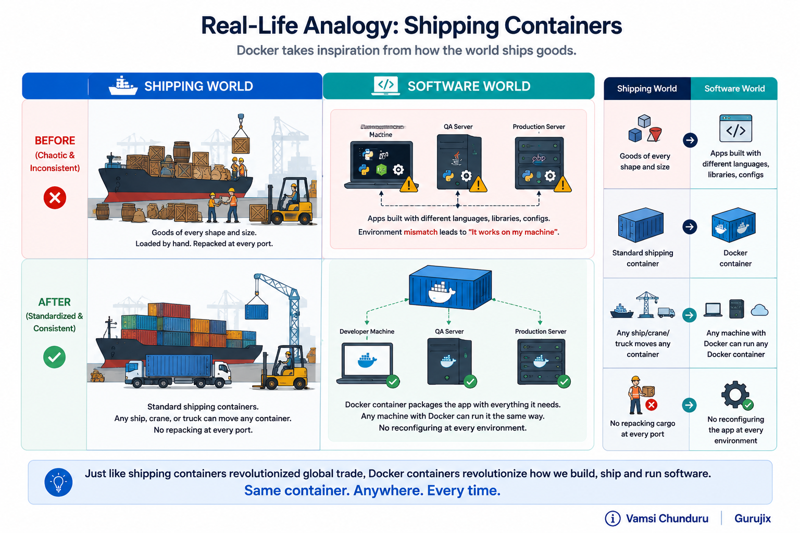
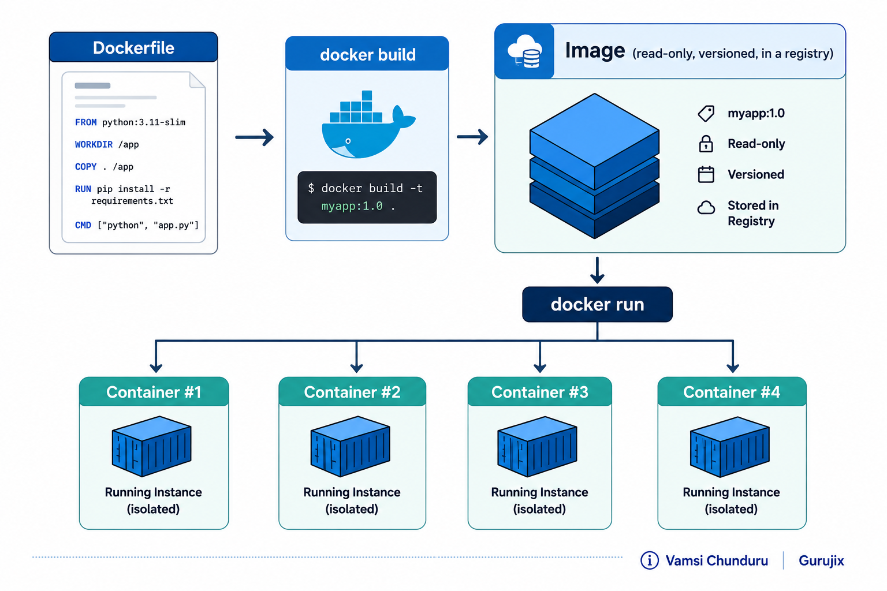
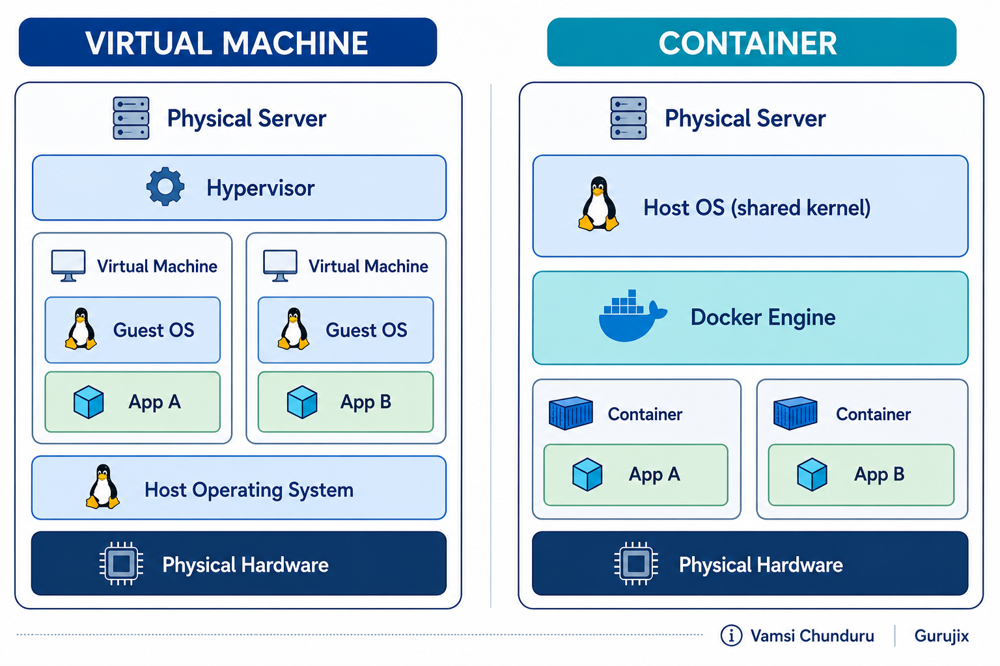
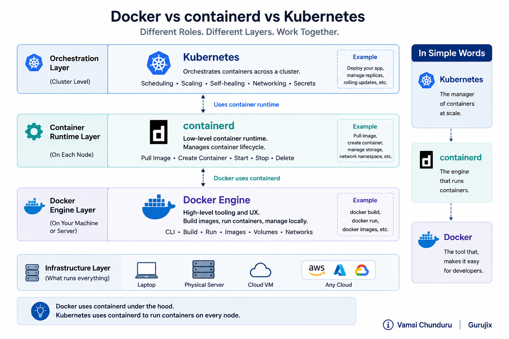

# Introduction to Docker

## 📌 Chapter Info

- **Prerequisites:** None — this is a starting point. A basic idea of what "running an application" means helps, but isn't required.
- **⏱ Estimated Reading Time:** 20–25 minutes
- **Difficulty:** 🟢 Beginner

---

## 📖 Overview

Every backend engineer eventually hears the same sentence: **"It works on my machine."**

That one sentence led to one of the biggest shifts in modern software engineering. 🐳 Docker wasn't created to make deployment feel modern. It was created to solve a much deeper problem — making applications run consistently, no matter where they run.

In this chapter, we'll understand why Docker exists, how it's different from a 🖥 Virtual Machine, what an 📦 image and a 🚀 container actually are, and where Docker fits next to ☸ Kubernetes and ⚙️ containerd. No CLI deep-dive yet — that's Module 03. Here, we build the mental model everything else stands on.

---

## 🎯 Learning Objectives

By the end of this chapter, you'll be able to:

- Explain the exact problem Docker was built to solve
- Explain the difference between a Docker **image** and a Docker **container**
- Explain the difference between a Virtual Machine and a container — the mechanism, not just "VMs are heavier"
- Explain how Docker, containerd, and Kubernetes relate to each other
- Answer beginner-level Docker interview questions with confidence

---

## 🧠 Mental Model

> 🧠 **Mental Model**
>
> Think of Docker as: **packaging your application together with everything it needs to run.**
>
> NOT: a virtual machine.

Hold onto that sentence. Everything in this chapter is really just unpacking what it means.

---

## 🤔 The Problem Before Docker

You build a service. It runs fine on your laptop. You hand it to QA, and it breaks. Almost always, the reason is some version of the same thing:

- Your laptop has Python 3.9; the QA machine has Python 3.11
- A system library exists on your machine but not theirs
- Config values live only in your local `.env` file
- Your OS is macOS; production is Linux

None of this is a code bug — it's an *environment* mismatch. Five machines, five slightly different realities, one piece of code trying to survive all of them. The industry called this "works on my machine" syndrome, and for years it quietly cost teams real time and money.

**Before Docker, teams handled this two ways:**

1. **Detailed setup docs** — "install exactly this version, then that library, then these env vars." Fragile: one skipped step and you're back to square one.
2. **Virtual Machines** — package a full OS with your app, and run that same OS anywhere. This worked, but each VM carries its own full guest operating system: its own kernel, memory footprint, boot time. Ten small services meant ten full OS copies.

> 💭 **Why This Matters:** The problem was never "how do we run software." It was "how do we guarantee the same environment everywhere, without paying for a full OS per app."

> 💬 This chapter will mention a few new terms — namespaces, cgroups, OCI, containerd. If they feel unfamiliar, that's expected. We're introducing the ideas here; each one gets its own deep dive in a later chapter.

---

## 🌍 Real-Life Analogy: Shipping Containers

Docker is named after an actual industry transformation. Before the 1950s, cargo ships were loaded by hand — barrels, crates, sacks, every shape different, repacked at every port. Then the industry standardized on one thing: the **intermodal shipping container.** Fixed size, fixed shape. Any port, any crane, any truck could move it, regardless of what was inside.



Your app, packed into a Docker container, runs the same way on your laptop and in production. The host machine doesn't need to know or care what's inside.

---

## 🚀 The Concept: What Docker Actually Is

**Docker packages an application together with everything it needs to run — code, runtime, libraries, config — into a portable unit called a container, so that unit behaves identically anywhere.**

The mindset shift: before Docker, you made the *environment* match the app's expectations. With Docker, you ship the *environment the app expects*, bundled with the app itself. You stop asking "does this server have the right versions?" and start asking "is Docker installed?"

Two ideas carry this — we'll go deep on both in later chapters:

- **Image** — a read-only blueprint: code, runtime, dependencies, startup instructions. The sealed container sitting in the yard.
- **Container** — a running instance of that image. The same container, now loaded and in motion.

One image can produce many running containers, the same way one container design is manufactured and used thousands of times.

---

## 📦 Image vs Container

An **image** is a static, read-only blueprint — it never runs by itself. A **container** is a running (or stopped) instance created *from* an image, with its own writable layer, process, and lifecycle. One image, many independent containers — same design, many separate boxes.

> ⚠️ **Common Misconception**
>
> "I built a container" (when what actually happened was building an image — nothing is running yet).
>
> **Reality:** An image is the blueprint sitting in storage. A container only exists once something is actually running from that blueprint.



> ✅ **Quick Check**
>
> Can you answer?
> - What's the difference between an image and a container, in one sentence each?
> - Can a single image produce more than one running container at the same time?

> 📦 **In Practice**
>
> This "one blueprint, many runs" idea isn't just theory. Most CI/CD pipelines build a Docker image exactly once, then promote that *same, unchanged image* through dev → staging → production. Nothing gets rebuilt per environment — only the already-built image moves forward. That turns the image into a single source of truth, and it's a big part of why container-based deployments cut down on "it worked in staging but broke in prod" incidents.

---

## 💻 Practical Example: Seeing It, Not Just Reading About It

Deliberately tiny — the goal is to *see* a container exist, not learn the CLI (that's Module 03). If Docker is installed:

```bash
docker run hello-world
```

**What happens:**

1. Docker looks for the `hello-world` image locally, doesn't find it, and pulls it from Docker Hub.
2. Docker creates an isolated container from that image (new namespaces, cgroup limits applied).
3. The container runs a tiny program that prints a confirmation message.
4. The program finishes, and the container exits.

```
Unable to find image 'hello-world:latest' locally
latest: Pulling from library/hello-world
...
Hello from Docker!
This message shows that your installation appears to be working correctly.
```

The same image, on any machine with Docker, produces the same result — no OS matching, no manual config. That's this whole chapter, proven in one command.

---

## 🖥️ Virtual Machines vs Containers

A VM boots its own kernel and full guest OS per instance — strong isolation, heavy cost. A container shares the host's kernel; namespaces/cgroups make it *feel* isolated, without booting a separate OS. That's why containers start in milliseconds and images are megabytes, not gigabytes.

| | Virtual Machine | Docker Container |
|---|---|---|
| Isolation unit | Full guest OS + kernel | Process via namespaces/cgroups |
| Startup time | Seconds–minutes | Milliseconds–seconds |
| Typical image size | Gigabytes | Megabytes |
| Density per host | Low | High |

> ⚠️ **Common Misconception**
>
> Containers are lightweight virtual machines.
>
> **Reality:** Containers are not VMs. A VM virtualizes hardware and runs a full OS on top. A container virtualizes the OS itself, sharing one real kernel across many isolated apps. Different mechanism, not just "smaller."

**Trade-off, honestly:** shared kernel means the isolation boundary isn't as absolute as a VM's. For strict multi-tenant security, a VM (or containers running inside one, which is how most cloud instances actually work) is still the safer outer boundary.



> ✅ **Quick Check**
>
> Can you answer?
> - Why does a container start faster than a VM?
> - What two Linux kernel features make container isolation possible?

---

## 🧩 Docker, containerd & Kubernetes

Three tools, three layers — not competitors:

- **containerd** — a low-level *container runtime*. Its only job: pull an image, set up namespaces/cgroups, start/stop the process.
- **Docker Engine** — the developer-facing *platform* on top: the CLI, Dockerfile builds, Compose. Modern Docker uses containerd underneath to do this low-level work.
- **Kubernetes** — one layer above both: an *orchestrator*. It doesn't run containers directly; it decides which containers run where, restarts them, scales them, and needs a runtime like containerd underneath to actually do it.

> 💡 **Key Insight:** Docker and Kubernetes aren't "either/or." Docker builds and runs a container. Kubernetes runs that container reliably at scale across a cluster. You'll almost always meet them together.

This portability works because Docker, containerd, and Kubernetes all agree on a shared, vendor-neutral format called **OCI (Open Container Initiative)** — so an image built by one tool runs correctly on any of the others. We'll go deeper on OCI when it becomes practically relevant; for now, just know the format itself isn't locked to any single company.

> 📖 **Did You Know?**
>
> Docker launched in 2013 and became so popular, so fast, that people used "Docker" and "container" as interchangeable words. That popularity made the industry nervous — what if the format everyone depended on was controlled by one company? In 2015, Docker itself helped donate the container format to a neutral body, which became the **Open Container Initiative (OCI)** — the same standard above that keeps containers portable across tools today.



> ✅ **Quick Check**
>
> Can you answer?
> - If Kubernetes runs containers, why does it still need containerd?
> - What does OCI standardize, and why does that matter?

---

## ⚖️ Best Practices

- Treat containers as **disposable and stateless** — safe to kill and recreate anytime, with no critical data living only inside (state's real home is covered in the Volumes chapter).
- One container, **one responsibility** — not a mini VM running five background services.
- Get the vocabulary right early: image vs container, runtime vs platform vs orchestrator. Confusion here compounds later in Kubernetes and CI/CD docs.

**When should you use Docker?**
- An app needs to run identically across your laptop, staging, and production
- You're building microservices that each need their own isolated dependencies
- You're deploying to Kubernetes — containers are the unit it orchestrates

**When should you not?**
- A trivial, single-machine script with no deployment target — you'd be adding packaging overhead for nothing
- A workload that needs a hard OS-level security boundary — a VM (or containers running inside one) is the safer call there

---

## 🚫 Common Mistakes

- Assuming Docker gives VM-grade security isolation by default — it doesn't; don't run untrusted code assuming otherwise.
- Jumping straight to `docker run` flags without understanding *why* containers exist — brittle knowledge that breaks the moment someone asks "why not just use a VM?"

---

## 🏢 Production Perspective

Before containers, scaling meant provisioning more full VMs, each paying the OS tax. With containers, the same hardware runs far more services, because there's no per-service OS overhead — the image itself becomes the portable unit of truth across environments. More on this in the Production Best Practices and CI/CD with Docker chapters.

**Who uses Docker?**
- **Software Engineers** — packaging apps so they run identically everywhere
- **DevOps / Platform Engineers** — building the images and pipelines that ship those apps
- **QA Teams** — reproducing bugs in the exact environment they occurred in
- **Data Scientists** — increasingly packaging models and their dependencies the same way

---

## 🎤 Interview Questions

#### Beginner

1. What problem does Docker solve?
2. What's the difference between a Docker image and a Docker container?

#### Intermediate

1. How is a container different from a VM at a mechanism level?
2. What do namespaces and cgroups each do for a container?

#### Advanced

1. Explain the relationship between Docker, containerd, and the OCI spec.
2. If containers share the host kernel, what are the security implications, and how would you mitigate them?
3. Walk through what actually happens at the Linux kernel level when you run `docker run` — how does a container end up feeling like its own isolated machine?

#### Scenario-Based

1. A teammate says "let's just use a bigger VM instead of containers, it's simpler." How do you respond?
2. During a production incident, a teammate suggests exec-ing into the running container to patch it directly instead of rebuilding the image. How do you respond?

#### Troubleshooting

1. A container that ran fine in dev crashes immediately in production with no obvious code error. What's the first category of cause you'd investigate, and why?

> 📦 **In Practice:** Try answering these on your own first. Full, interview-ready answers to every question above — plus a Production category covering security, secrets, and observability — live in the [Docker Interview Prep bank](../../interview-prep/docker/README.md).

---

## 📝 Summary

Before Docker, teams fought environment inconsistency with fragile documentation or heavy VMs. Docker solved it by packaging an app with everything it depends on into a container, built from a read-only image, isolated via Linux namespaces and cgroups instead of a full guest OS. Docker, containerd, and Kubernetes are different layers of one stack — build/run, low-level runtime, and orchestration — kept portable by the OCI standard.

---

## 🎯 Key Takeaways

- Docker exists to eliminate environment inconsistency, not just to modernize deployment.
- Mental model: Docker packages your app with everything it needs to run — it is *not* a VM.
- Image = blueprint. Container = running instance.
- Docker, containerd, and Kubernetes are layers, not alternatives.
- OCI keeps the container format vendor-neutral.

---

## ✅ Self Assessment

- [ ] Can I explain why Docker exists, using the shipping container analogy?
- [ ] Can I explain image vs container without hesitating?
- [ ] Can I explain why a container starts faster than a VM?
- [ ] Can I place Docker, containerd, and Kubernetes at their correct layer?
- [ ] Could I confidently answer "why not just use a VM?" in an interview?

If any of these feel shaky, re-read that section before moving to Module 02.

---

## 📚 References

1. [Docker Official Documentation — What is a Container?](https://www.docker.com/resources/what-container/)
2. [Open Container Initiative (OCI)](https://opencontainers.org/)
3. [containerd Official Site](https://containerd.io/)
4. [Kubernetes Documentation — Container Runtimes](https://kubernetes.io/docs/setup/production-environment/container-runtimes/)
5. [Linux Kernel Namespaces (man7.org)](https://man7.org/linux/man-pages/man7/namespaces.7.html)
6. [Linux Kernel cgroups (man7.org)](https://man7.org/linux/man-pages/man7/cgroups.7.html)

---

## 🚀 What's Next?

You now have the mental model everything else in this handbook builds on:

- ✓ Why Docker exists — solving environment inconsistency, not just "modernizing" deployment
- ✓ Image vs container — a static blueprint vs a running instance
- ✓ Container vs VM — shared kernel + namespaces/cgroups vs a full guest OS
- ✓ Where Docker, containerd, and Kubernetes each sit in the stack

In the next chapter, we stop talking about Docker and start using it — a quick install/setup pass (Docker Desktop, Docker Engine on Linux, verifying your setup works), then straight into the CLI fundamentals with real containers running.

---

⬅️ **Previous:** None — this is the first chapter.
➡️ **Next:** Docker Fundamentals — Coming soon
