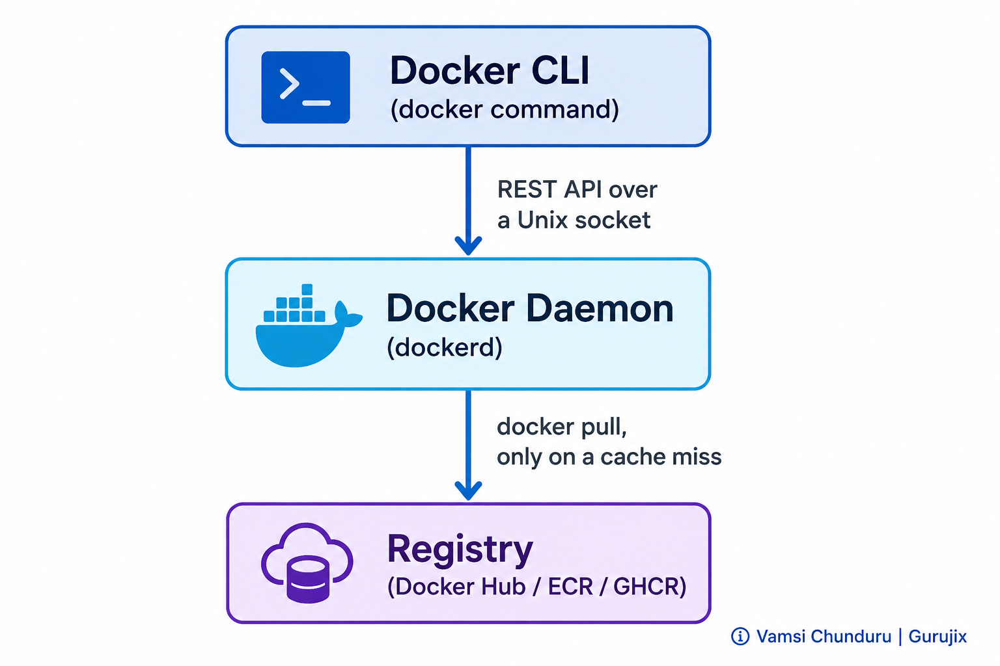
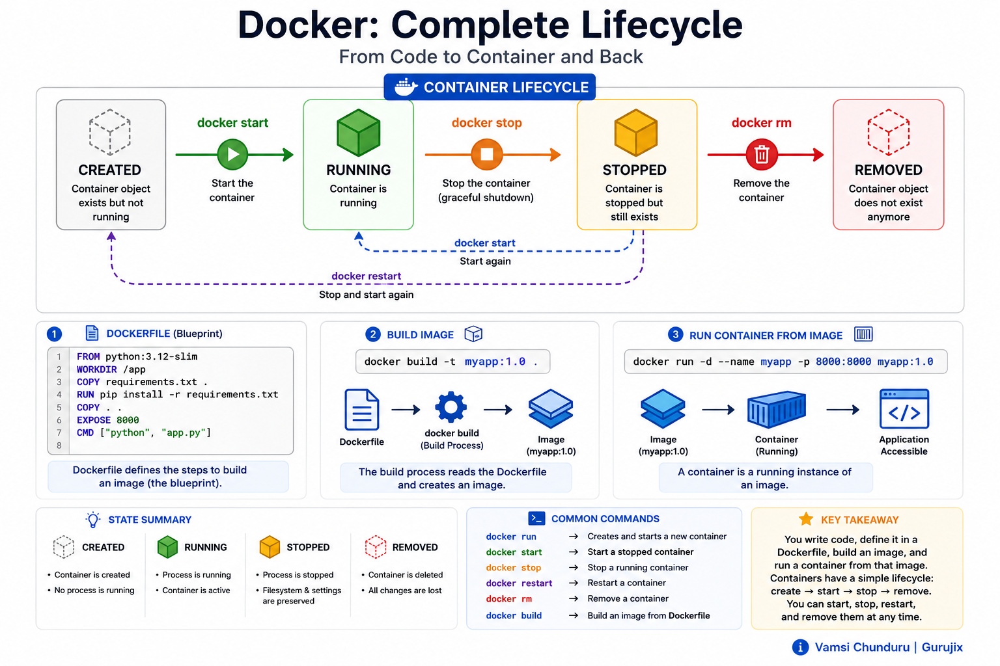
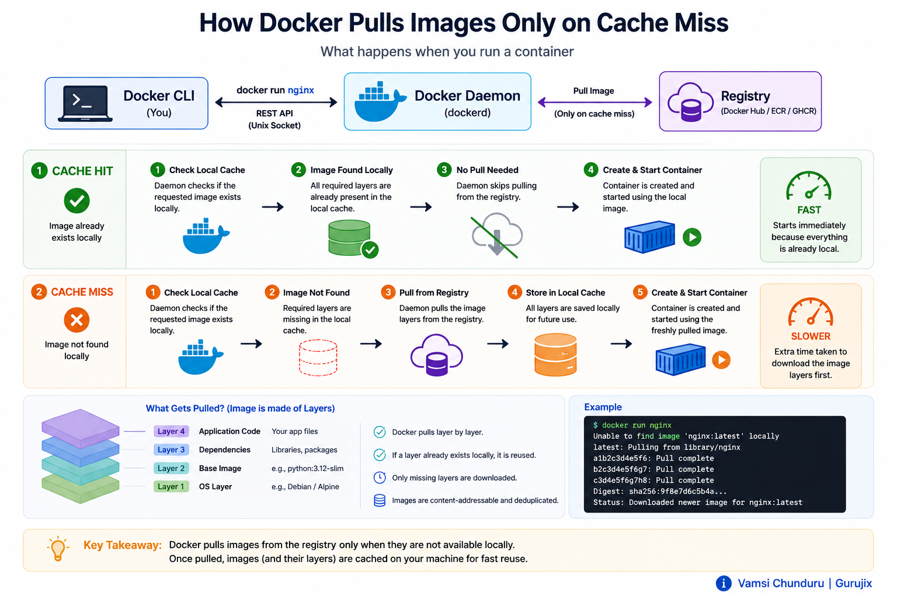

# 🐳 Docker Fundamentals

> Part of the [Software Engineering Handbook](../../README.md) → [Docker](../README.md)

---

## 📋 Chapter Info

| | |
|---|---|
| **Module** | 02 — Docker Fundamentals |
| **Prerequisites** | [01 — Introduction to Docker](../01-introduction/README.md) |
| **Estimated Reading Time** | 12–15 minutes |
| **Difficulty** | Beginner |

---

## 🧭 Overview

You type `docker run nginx`. A container appears. But what actually *did* that? Was it the `docker` program itself? Something running in the background? A remote server somewhere?

Most beginners never stop to ask, and it costs them later — every "what happens internally" interview question, every "why is this container still using the old image" bug, and every confusing error message all trace back to not knowing who's actually doing the work behind that one command.

This chapter fixes that with exactly one idea: Docker is three separate components doing three separate jobs, and everything you'll ever do with it is a lifecycle operation on one of two things — an image or a container.

---

## 🎯 Learning Objectives

By the end of this chapter, you should be able to:

- Name the three components behind every Docker command and explain what each one actually does
- Explain what the Docker daemon is, and why it — not the CLI — is Docker's real engine
- Walk through the full container lifecycle: created, running, stopped, removed
- Explain what happens, step by step, when the daemon needs to pull an image it doesn't have cached

---

## 🧠 Mental Model

**Docker is a client-server system, and everything you do is a lifecycle operation on one of two things: an image (a blueprint) or a container (a running instance of that blueprint).**

The `docker` command you type is not the thing doing the work — it's a messenger. It talks to a background service (the daemon) over an API, and that daemon is the one actually pulling images, creating containers, and managing the filesystem and network underneath them.

NOT: "Docker" as one single program that does everything itself. Once you see the client and the daemon as two separate things, every command stops being a magic word and becomes a specific, explainable instruction to the daemon.

> 💡 **Key Insight:** You never talk to Docker directly. You talk to a CLI, which talks to a daemon, which does the work. Keeping that chain straight is what makes internals questions ("what happens when...") easy instead of confusing.

---

## ❗ The Problem: An Architecture Nobody Explains

Tutorials teach `docker run` on day one and rarely explain what's behind it. That gap doesn't matter until something breaks: a `docker run` hangs and you don't know if that's the CLI, a slow network pull, or a stuck background service. An image update doesn't show up in a running container, and you don't know whether that's expected (containers don't auto-update) or a caching bug. `docker version` prints two version numbers and you've never wondered why.

None of this is because Docker is hard. It's because the architecture underneath the CLI was never named. Once you know there's a client, a daemon, and a registry — and that they only talk to each other in specific, predictable ways — these situations stop being mysterious and become "which of the three is the problem."

> 💬 Some of the terms in this chapter (namespaces, cgroups, OCI) get their own deep dive in later chapters — you don't need to fully understand them yet to follow the architecture here.

---

## 🍳 Real-Life Analogy: The Restaurant

Think of Docker like ordering food at a restaurant:

- **You (the customer)** are the **Docker CLI** — you don't cook anything, you just place orders.
- **The waiter** is the **Docker client** — takes your order (`docker run nginx`) and passes it to the kitchen.
- **The kitchen** is the **Docker daemon (`dockerd`)** — the one doing actual work: preparing dishes (containers) from recipes (images).
- **The supplier/warehouse** is the **registry** (Docker Hub, ECR, GHCR) — where recipes (images) are stored and fetched from if the kitchen doesn't already have them in stock.
- **The recipe card** is the **image** — a fixed, reusable blueprint.
- **The actual plated dish in front of you** is the **container** — one specific instance made from that recipe, right now.

You never walk into the kitchen yourself. You place an order, the waiter relays it, and the kitchen decides whether it already has the ingredients (the image is cached locally) or needs to call the supplier first. That's the entire architecture in one sentence — and it's the analogy the next chapter, Docker CLI, will keep coming back to for specific commands.

---

## 🖼️ Hero Illustration



---

## 📖 The Concept: Three Components, Three Jobs

- **Docker Client** — the `docker` binary you type commands into. It doesn't run containers; it packages your command into an API request.
- **Docker Daemon (`dockerd`)** — a long-running background process that receives those API requests and does the actual work: managing images, containers, networks, and volumes. This is Docker's real engine.
- **Registry** — a storage and distribution service for images. Docker Hub is the public default; most companies also run a private one (AWS ECR, GitHub Container Registry, Harbor). The daemon only talks to a registry when it needs an image it doesn't already have locally.

> 🎯 **Quick Check:** If someone says "Docker is slow to start," ask which of the three they mean — a slow client response usually means the daemon isn't running; a slow `docker run` on a new image usually means it's mid-pull from the registry. Same symptom, different component, different fix.

---

## 🔁 Container Lifecycle

A container moves through a small, well-defined set of states, and every command you'll learn in the next chapter is really just a way of moving a container between them:

```
docker create → Created
docker start  → Running
docker stop   → Stopped (Exited)
docker start  → Running (again)
docker rm     → Removed (gone)
```

`docker run` is shorthand for `create` + `start` in one step — which is exactly why you'll rarely see `docker create` used on its own in day-to-day work.



> 📦 **In Practice:** `docker run` almost always replaces `docker create` + `docker start` in real workflows — you'll mostly see `create` used standalone in scripting/automation contexts where you want to configure a container before deciding to start it.

---

## ⚙️ How It Works: What Happens When the Daemon Needs an Image

Here's the architecture in motion — what actually happens the first time the daemon is asked to run a container from an image it doesn't have cached:

1. **The CLI parses your command** and turns it into a REST API request.
2. **The request is sent to the daemon** over a local Unix socket (`/var/run/docker.sock` on Linux).
3. **The daemon checks its local image cache.** Nothing found for this image.
4. **The daemon pulls the image from the registry** — layer by layer.
5. **The daemon creates a container** from that image — its own writable layer, its own namespaces, its own cgroup limits (the exact kernel mechanics are covered in [Interview Prep → Docker → Core Concepts](../../interview-prep/docker/1-core-concepts.md)).
6. **The daemon starts the container's process.**

> 🧠 The second time the daemon is asked for the same image, step 4 disappears entirely — it finds the layers already cached locally and jumps straight to step 5. That's why the first run of any new image is slow, and every one after it is instant — a caching behavior, not a coincidence.



---

## 🏗️ Architecture: Where State Lives

The daemon keeps two kinds of state on disk, and knowing where each lives is what makes troubleshooting make sense later:

- **Image layers** — read-only, stored once, shared across every container built from that image (this is why ten containers from the same image don't cost ten times the disk space).
- **Container state** — each container gets its own thin writable layer on top of its image's layers, plus its own config (environment variables, port mappings, restart policy) recorded by the daemon.

This split is *why* deleting an image that a container still depends on fails — the daemon won't let you remove a layer something else still depends on.

---

## ❌ Common Misconceptions

- **"The container ID and image ID are basically the same thing."** They're not — an image ID identifies a static blueprint; a container ID identifies one specific running/stopped instance. One image can produce many containers, each with its own unique ID.
- **"The daemon is just part of the `docker` CLI program."** It's a separate, independently-running service (`systemctl status docker` on Linux) — the CLI can be reinstalled or even removed from a machine without touching the daemon at all.

---

## ✅ Best Practices

- Before assuming "Docker is broken," identify which component is actually failing — client, daemon, or registry — the fix is completely different for each.
- Don't script around `docker create` unless you specifically need to configure a container before starting it — `docker run` is the right default for almost everything.
- When something is unexpectedly slow, check whether it's a registry pull (network-bound) before assuming it's a local performance problem.

---

## 🚨 Common Mistakes

- **Treating "Docker" as one indivisible thing** when debugging, instead of asking whether the client, daemon, or registry is the one actually failing.
- **Assuming a stopped container is gone.** `docker stop` only stops the process — the container, and its writable layer, still exist until it's explicitly removed.
- **Being surprised that the first run of a new image is slow** and not realizing every subsequent run of that same image will be fast, because of local layer caching.

---

## 🏭 Production Perspective

In production, you rarely run raw `docker run` commands by hand — orchestrators (Kubernetes, ECS) issue the equivalent daemon API calls for you, on a schedule, with health checks and restart policies attached. But every one of those systems is still driving the exact same client → daemon → registry flow underneath; understanding this layer is what makes reading a Kubernetes pod's events or an ECS task's stopped-reason actually diagnosable instead of opaque. The daemon's local image cache also matters operationally at scale — a fleet of nodes all cold-pulling the same image on deploy is a common, avoidable source of slow rollouts, which is why pre-pulling and registry proximity (same-region ECR, for instance) are real production concerns, not micro-optimizations.

---

## 🎤 Interview Questions

**Beginner**

- What is Docker Engine? What is the Docker daemon?
- What is the difference between the Docker client, the Docker daemon, and a registry?
- What is the difference between image ID and container ID?

**Intermediate**

- Why is the first `docker run` of a new image slow, and every one after it instant?

**Advanced**

- Walk through the exact client → daemon → registry flow for a request that requires an image pull.

> 📦 **In Practice:** Full, interview-ready answers to these — plus deeper mechanism and production questions — are in [Interview Prep → Docker](../../interview-prep/docker/README.md).

---

## 📝 Summary

Docker's architecture is smaller than it looks: a client that only relays commands, a daemon that does all the real work, and a registry that supplies images the daemon doesn't already have cached. Every container you'll ever run moves through the same small set of lifecycle states — created, running, stopped, removed — and that state machine is the foundation the next chapter builds on when it introduces the actual commands that drive it.

---

## 🔑 Key Takeaways

- The `docker` CLI never does the work itself — it's a thin client talking to the daemon over an API.
- `dockerd` is the real engine: it manages images, containers, networks, and volumes.
- A registry is only involved on a cache miss — most `docker run` calls never touch it.
- Images and containers are different lifecycle objects with different IDs — one image, many possible containers.
- A container's lifecycle has exactly four states: created, running, stopped, removed.

---

## ✅ Self Assessment

- [ ] I can name the three components behind every Docker command and what each one does.
- [ ] I can explain why the daemon, not the CLI, is Docker's real engine.
- [ ] I can walk through what happens on a cache miss vs. a cache hit when the daemon needs an image.
- [ ] I can list all four container lifecycle states in order.

---

## 📚 References

- [Docker Engine overview — official docs](https://docs.docker.com/engine/)
- [Docker daemon (`dockerd`) reference — official docs](https://docs.docker.com/reference/cli/dockerd/)

---

## 🔮 What's Next?

You now know *what* Docker is made of and the state machine every container moves through. The next chapter, **Docker CLI**, puts that model to work — the actual commands (`pull`, `run`, `ps`, `logs`, `exec`, `inspect`, `stop`, `start`, `rm`, `rmi`) you'll type daily, each one mapped directly onto the lifecycle you just learned.

---

## 🔗 Chapter Navigation

⬅️ **Previous:** [01 — Introduction to Docker](../01-introduction/README.md)
➡️ **Next:** [03 — Docker CLI](../03-docker-cli/README.md)
