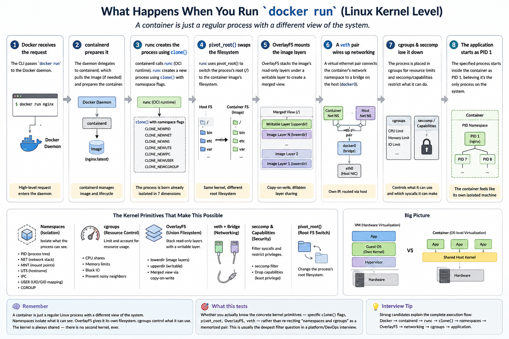

# 🎤 Docker Interview Questions — Core Concepts

> Part of the [Software Engineering Handbook](../../README.md) → [Interview Prep](../README.md) → [Docker](./README.md)

Straight conceptual questions — the ones that check whether you actually understand Docker, not just whether you've memorized commands. Ordered from foundational to senior-level.

---

### 1. What problem does Docker solve?

**Answer:**
Docker solves *environment inconsistency* — the "works on my machine" problem. Before Docker, an app's behavior depended on the exact OS version, installed libraries, and config of whatever machine it ran on, so the same code could work in dev and break in QA or production.

Docker packages the app together with its entire runtime environment — code, runtime, dependencies, config — into a single portable unit (an **image**) that behaves identically wherever it runs. It replaced two older approaches: detailed manual setup docs (fragile — one skipped step breaks everything) and full Virtual Machines (isolate well, but each one boots a full guest OS, paying real cost in memory, disk, and boot time). Docker gets VM-like isolation using two Linux kernel features — namespaces and cgroups — without the overhead of a separate OS per app.

> 🧠 **Remember:** Docker doesn't solve deployment — it solves environment consistency.

> 🎯 **What this tests:** Whether you understand *why* Docker exists, not just "it's containers." A strong answer connects environment consistency to the cost/isolation trade-off against VMs — not just "it's lightweight."

---

### 2. What's the difference between a Docker image and a Docker container?

**Answer:**
An **image** is a static, read-only blueprint — filesystem layers plus metadata (entrypoint, environment variables, exposed ports) built from a Dockerfile. It never runs by itself; it just sits in storage (locally or in a registry).

A **container** is a running (or stopped) *instance* created from an image, with its own writable layer on top, its own process, its own network namespace, and its own lifecycle. One image can produce many independent, simultaneously running containers — the same way one class definition produces many object instances.

> 🧠 **Remember:** One image, many containers — same relationship as a class and its objects.

> 🎯 **What this tests:** Precision. This is the single most common terminology mix-up in real teams — people say "I deployed a container" when they actually built and pushed an image. Interviewers use this question to see if you're exact with the vocabulary.

---

### 3. What's the actual difference between the Docker client, the Docker daemon, and a registry — and why does that split matter?

**Answer:**
These are three separate components with three separate jobs, and conflating them is what makes "what happens when I run a command" feel like magic. The **Docker client** is the `docker` binary you type into — it does no real work itself; it parses your command into a REST API request. The **Docker daemon** (`dockerd`) is a long-running background service that receives that request over a local Unix socket (`/var/run/docker.sock` on Linux) and does the actual work: managing images, containers, networks, and volumes on disk. The **registry** (Docker Hub, AWS ECR, GHCR) is a separate storage/distribution service the daemon talks to only when it needs an image it doesn't already have cached locally.

The reason this split matters practically: a "Cannot connect to the Docker daemon" error means the client is fine but `dockerd` isn't running or reachable — a service problem, not a syntax problem. And a slow `docker run` on a fresh image is the daemon reaching out to the registry, not the client doing anything slow.

> 🧠 **Remember:** You never talk to Docker directly — client → daemon → (registry only if needed). Most "why is this broken" questions are really "which of these three is the problem."

> 🎯 **What this tests:** Whether you can localize a fault to the right component instead of treating "Docker" as one undifferentiated black box.

---

### 4. What's the actual difference between an image ID and a container ID, and why do people conflate them?

**Answer:**
An **image ID** is a hash of a static, read-only blueprint — filesystem layers plus config (entrypoint, env vars, exposed ports). A **container ID** identifies one specific runtime instance created from an image, with its own writable layer, its own network namespace, and its own lifecycle state (created, running, stopped). One image can produce many container IDs, each independent of the others.

People conflate them because both `docker images` and `docker ps` print similar-looking hex hashes, and because `docker run <image>` visually looks like it's "the same thing" continuing — when it actually creates a brand-new container ID every single time it's called, even against the same image.

> 🧠 **Remember:** One image ID, many possible container IDs — `docker run` always mints a new container ID, it never reuses one.

> 🎯 **What this tests:** Precision under real usage, not just definitions — this is the exact confusion that causes people to accidentally spin up duplicate containers while debugging.

---

### 5. What's the difference between `docker run`, `docker start`, and `docker exec`?

**Answer:**
`docker run` always creates a **brand-new container** from an image — new container ID, fresh writable layer — even if you run the identical command twice. `docker start` resumes an **existing, already-created** container — same ID, same filesystem state it had when it stopped, no new image lookup involved. `docker exec` doesn't touch the container's lifecycle at all — it opens an additional process *inside* an already-running container's namespaces, most commonly used to get a shell (`docker exec -it <container> sh`) into something that's already up.

> 🧠 **Remember:** `run` creates, `start` resumes, `exec` visits — only `run` ever produces a new container ID.

> 🎯 **What this tests:** Whether you actually understand container identity and lifecycle state, not just three command names — this is one of the most common practical mix-ups in real day-to-day Docker usage.

---

### 6. Why is the first `docker run` of a new image slow, and every one after it instant?

**Answer:**
The first time, the daemon checks its local image cache, finds nothing, and has to pull every layer of that image from the registry over the network before it can create the container — that network round-trip is where the time goes. Every subsequent `docker run` of the same image tag finds those layers already cached locally (Docker's layers are content-addressed, so an unchanged layer is recognized and reused rather than re-fetched), so the daemon skips the pull step entirely and jumps straight to creating the container — which is why it feels near-instant.

This is also why a fleet of nodes cold-pulling the same image simultaneously during a deploy is a real, common source of slow rollouts in production — pre-pulling or warming images ahead of a release directly avoids this.

> 🧠 **Remember:** Slow first run = registry pull; fast every run after = local layer cache hit. Same mechanism explains slow cluster-wide rollouts of a brand-new image.

> 🎯 **What this tests:** Whether you connect the client-daemon-registry model to an observed, everyday behavior (the first-run pause) instead of treating it as an unexplained quirk.

---

### 7. Why does `docker rmi` sometimes fail with an "image is being used by a container" error, and how do you resolve it?

**Answer:**
The daemon tracks that every container's writable layer sits on top of specific image layers underneath it. Deleting an image that a container — even a *stopped* one — still depends on would orphan that container's filesystem, so the daemon refuses the delete rather than silently corrupting it.

To resolve it: run `docker ps -a` (not just `docker ps` — the dependent container is very often stopped, not running) to find every container built from that image, remove them with `docker rm` (or `docker rm -f` if one is still running), then retry `docker rmi`. Forcing it with `docker rmi -f` without cleaning up the containers first just untags the image while its layers stay on disk, invisibly, until those containers are removed anyway — it doesn't actually solve the dependency, it just hides it.

> 🧠 **Remember:** `docker rmi` failing means a container — often a stopped one you forgot about — still depends on that image. Find it with `docker ps -a`, remove it, then retry.

> 🎯 **What this tests:** Whether you understand the image/container dependency at the layer level, or just memorize `-f` as a way to force past any error without understanding what it's actually bypassing.

---

### 8. How is a container different from a VM at a mechanism level?

**Answer:**
A **VM** runs on a hypervisor that virtualizes hardware. Each VM boots its own full guest operating system — its own kernel, its own memory footprint, its own boot sequence — on top of that virtual hardware. This gives strong isolation, but it's heavy: gigabytes per image, seconds to minutes to boot.

A **container** has no hypervisor and no guest kernel. It shares the host's kernel. Isolation comes from two Linux kernel primitives instead:

- **Namespaces** — give the container its own *view* of the system (its own process tree, network interfaces, mounts, hostname), so it feels like a separate machine even though it's really just a process on the host.
- **Cgroups** — enforce resource *limits* (CPU, memory, I/O) so no single container can starve the others.

Because there's no separate OS to boot, containers start in milliseconds and images are typically megabytes, not gigabytes.

> 🧠 **Remember:** No hypervisor, no guest kernel — containers virtualize the OS, VMs virtualize the hardware.

> 🎯 **What this tests:** Mechanism-level understanding. "Containers are lighter" is not a complete answer — naming namespaces and cgroups specifically is what separates a memorized answer from real understanding.

---

### 9. What do namespaces and cgroups each do for a container?

**Answer:**
Split them cleanly — they solve two different problems:

- **Namespaces control visibility.** Each namespace type isolates one dimension of what a process can see: PID (its own process tree), network (its own interfaces/ports), mount (its own filesystem view), UTS (its own hostname), IPC, and user (its own UID/GID mapping). Together, they make a container believe it's on its own machine.
- **Cgroups (control groups) control consumption.** They cap and account for CPU shares, memory limits, and block I/O per container, and can throttle or OOM-kill a container that exceeds its budget. This is what prevents a "noisy neighbor" container from starving everything else on the host.

> 🧠 **Remember:** Namespaces decide what a container can see, cgroups decide what it can use.

> 🎯 **What this tests:** Depth beyond buzzwords — can you name concrete namespace types and explain what cgroups actually enforce, not just recite the two words.

---

### 10. Walk through what actually happens at the Linux kernel level when you run `docker run` — how does a container end up feeling like its own isolated machine?

**Answer:**
Nothing gets virtualized in the VM sense — there's no second kernel and no virtual hardware. A container ends up as a completely ordinary Linux process, just started with a deliberately restricted *view* of the one real kernel already running. Here's the flow, in order:

1. **Docker hands off the request.** The CLI passes `docker run` to the Docker daemon, which delegates the actual work to containerd.
2. **containerd manages the lifecycle.** It pulls the image if it isn't cached locally, then hands container creation to the low-level runtime, `runc`.
3. **`runc` calls `clone()` with namespace flags.** Flags like `CLONE_NEWPID`, `CLONE_NEWNET`, `CLONE_NEWNS`, `CLONE_NEWUTS`, `CLONE_NEWIPC`, `CLONE_NEWUSER`, `CLONE_NEWCGROUP` mean the process is born already isolated across seven dimensions — its own process tree, network stack, mounts, hostname, IPC, user/group mapping, and cgroup view.
4. **`pivot_root` swaps the filesystem.** The process's `/` is switched to the image's unpacked filesystem — the modern, safer version of `chroot`. Same kernel binary, entirely different filesystem view.
5. **OverlayFS mounts the image layers.** The image's read-only layers (`lowerdir`) stack under the container's writable layer (`upperdir`) into one merged view, so hundreds of containers can share the same base layers on disk via copy-on-write instead of duplicating them.
6. **A `veth` pair wires up networking.** A virtual ethernet pair connects the container's new network namespace to a bridge on the host (`docker0` by default) — its own IP, still routed through the host.
7. **cgroups and seccomp lock it down.** The process is placed into a cgroup that caps its CPU/memory/IO, and seccomp/capabilities filtering restricts which syscalls and privileges it can use at all — layered on top of the namespaces, not replacing them.
8. **The process starts** — as its own PID 1, believing it's alone on the machine.

Every one of those steps restricts *visibility or resource access*; none of them swap out the kernel itself. That's precisely why it's called **OS-level virtualization**, not virtualization in the hypervisor sense, and precisely why a container can never run a different kernel than its host (no Windows containers on a Linux host, no picking a different kernel version per container) — there's only ever one kernel underneath all of them.

> 🧠 **Remember:** A container is just a regular Linux process — `clone()` with namespace flags, `pivot_root` for its filesystem, OverlayFS for layers, and cgroups for limits. There's no second kernel, ever.

> 🎯 **What this tests:** Whether you actually know the concrete kernel primitives — specific `clone()` flags, `pivot_root`, OverlayFS, `veth` — rather than re-reciting "namespaces and cgroups" as a memorized pair. This is usually the deepest filter question in a platform/DevOps interview, separating people who've read about containers from people who've had to debug one at the syscall level.

---

### 11. Explain the relationship between Docker, containerd, and the OCI spec.

**Answer:**
It's a layered stack, not competing tools:

- **Docker Engine** is the developer-facing platform — the CLI, Dockerfile builds, Compose, image management. Since the Moby restructuring, Docker doesn't handle low-level container lifecycle itself; it delegates that to containerd underneath.
- **containerd** is a lower-level, high-performance container runtime (a CNCF graduated project). Its job is narrow: pull images, manage container lifecycle (create/start/stop/delete), handle storage/snapshotting. It exposes an API that Kubernetes talks to directly via the Container Runtime Interface (CRI) — Kubernetes doesn't need Docker installed at all.
- **OCI (Open Container Initiative)** isn't a runtime — it's a specification. It defines the image format (OCI Image Spec) and the runtime contract (OCI Runtime Spec, implemented in practice by `runc`), so any OCI-compliant image runs on any OCI-compliant runtime.

Chained together: **Docker → containerd → runc → Linux kernel primitives (namespaces/cgroups)**, with OCI as the vendor-neutral contract every layer agrees to. That's exactly why an image built by Docker also runs directly under containerd or Kubernetes with no Docker installed on the node.

> 🧠 **Remember:** Docker → containerd → runc → kernel — OCI is the shared contract that keeps every layer swappable.

> 🎯 **What this tests:** Architectural understanding — this is a favorite at intermediate/senior DevOps interviews, especially framed as "why did Kubernetes remove dockershim in 1.24, and why did nothing actually break?"

---

### 12. If containers share the host kernel, what are the security implications, and how would you mitigate them?

**Answer:**
Because every container on a host shares one kernel, the isolation boundary is fundamentally weaker than a VM's:

- A kernel-level exploit or container-breakout CVE has one shared attack surface — a compromise can potentially affect the host and every other container on it, not just one isolated VM.
- Containers running as root, with `--privileged`, or with excessive Linux capabilities can reach host devices or namespaces they shouldn't.
- Without resource limits, a compromised or buggy container can consume host CPU/memory and degrade every co-located container (noisy neighbor / denial of service).

**Practical mitigations, in order of what actually matters in production:**

- Never use `--privileged` unless there's no alternative; drop all capabilities by default and add back only what's required (`--cap-drop=ALL`, then add specific ones).
- Run containers as a non-root user (`USER` in the Dockerfile) instead of the default root.
- Use read-only root filesystems where the app allows it.
- Enforce cgroup resource limits (`--memory`, `--cpus`, or Kubernetes resource requests/limits) on every container, not just the ones you suspect.
- Apply seccomp, AppArmor, or SELinux profiles to restrict available syscalls.
- For genuinely untrusted or multi-tenant workloads, add a stronger isolation layer: run containers inside VMs (the default on most managed cloud platforms already), or use a sandboxed runtime like **gVisor** or **Kata Containers**, which interpose an extra isolation layer between the container and the host kernel.
- Keep the host kernel and container runtime patched — most breakout CVEs get fixed quickly, but only if you're actually applying updates.

> 🧠 **Remember:** One shared kernel means one shared attack surface — drop capabilities, skip `--privileged`, and reach for gVisor/Kata for untrusted workloads.

> 🎯 **What this tests:** Security maturity. A weak answer stops at "don't run privileged containers." A strong senior-level answer gives a layered mitigation strategy and knows when to reach for gVisor/Kata for genuinely untrusted workloads.
